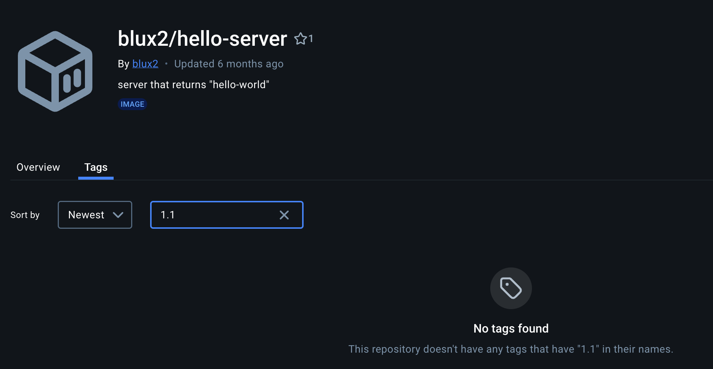

# kindの操作

## ローカル環境(Mac)でのセットアップ

### インストール

```bash
$ brew install kind

$ kind version
kind v0.23.0 go1.22.3 darwin/amd64
```

### クラスタ作成

DockerHubのkindest/nodeリポジトリを使用できる

```bash
$ kind create cluster --image=kindest/node:v1.29.0
Thanks for using kind! 😊
```

削除

```bash
$ kind get clusters
kind
$ kind delete cluster -n kind
```

dockerのコンテナとしてクラスタ環境が作成される


### 状態確認

```bash
$ kubectl cluster-info --context kind-kind
Kubernetes control plane is running at https://127.0.0.1:53902
CoreDNS is running at https://127.0.0.1:53902/api/v1/namespaces/kube-system/services/kube-dns:dns/proxy

To further debug and diagnose cluster problems, use 'kubectl cluster-info dump'.
```

### kubectlのconfig

k8sのクラスタアップデート時に操作する可能性あり

場所：` ~/.kube/config`

```bash
$ cat ~/.kube/config
apiVersion: v1
clusters:
- cluster:
    certificate-authority-data: 省略
    server: https://127.0.0.1:53902
  name: kind-kind
contexts: //クラスタの設定情報ごとに名前のついたコンテキストが作成される
- context:
    cluster: kind-kind
    user: kind-kind
  name: kind-kind
current-context: kind-kind
kind: Config
preferences: {}
users:
- name: kind-kind
  user:
    client-certificate-data: 省略
    client-key-data: 省略
```

複数クラスタに接続する際の接続情報もここに記載

`kubectl cluster-info --context kind-kind`の`context`は↑の定義から取得している

`kucectl config use-context`で`--context`オプションをつけないときのデフォルトコンテキストを指定可能(`kubectx`で代替可能)

### クラスタの削除

```bash
$ kind delete cluster
Deleting cluster "kind" ...
Deleted nodes: ["kind-control-plane"]
```

## k8sについて

### マニュフェスト

`.yaml/.yml`を拡張子とするYML形式のファイルで表される。

ファイルには動作させたいリソースの**仕様**を記載する。※NGINXというコンテナを動作させたい、など

JSON形式で記載することも可能

- k8sではマニュフェストというYMLファイルを使ってコンテナを起動する
- マニュフェストを起動するために**kubectl**を使う
  - kubectlコマンドでk8sクラスタと通信する

### Podについて

コンテナを起動するための最小構成リソース=Pod

Podは複数コンテナをまとめて起動できる

下記はまとめて一つのPodとして起動することが多い

- Aというサービス
- ログを転送するサービス
  - メインのサービスに付帯するプログラム=サイドカー

```sample
apiVersion: v1
kind: Pod
metadata:
  name: nginx
spec:
  containers:
  - name: nginx
    image: nginx:1.25.3
    ports:
    - containerPort: 80
```

マニュフェストに指定できるオプションは[リファレンス](https://kubernetes.io/docs/reference/generated/kubernetes-api/v1.29/)を参考

### Namespace

リソースを作成するための場所=Namespace

- 単一クラスタ内のリソースを分離するメカニズムを提供
- リソースの名前はNamespace内では一位である必要がある

#### kube-system Namespaceについて

Control PlaneやWorker Nodeで起動するk8sのシステムコンポーネントのPodが利用するNamespace

```bash
$ kubectl get pod --namespace kube-system
NAME                                         READY   STATUS    RESTARTS   AGE
etcd-kind-control-plane                      1/1     Running   0          13s
kube-apiserver-kind-control-plane            1/1     Running   0          13s
kube-controller-manager-kind-control-plane   1/1     Running   0          13s
kube-scheduler-kind-control-plane            1/1     Running   0          13s
```

### k8sの起動確認

```bash
$ kubectl get nodes
NAME                 STATUS   ROLES           AGE   VERSION
kind-control-plane   Ready    control-plane   21m   v1.29.0
```

#### kindの場合

```bash
$ kind get clusters
kind // デフォルトで作成されるクラスタ名はkind
```

### リソースの確認

```bash
$ kubectl get pod --namespace default
No resources found in default namespace.
```

- `kubectl get <リソース名>`でリソースの情報を取得
- `--namespace(-n)`オプションでNamespaceを指定して実行
  - 省略可能
- `default` Namespaceはクラスタ作成時に自動で作成される
  - 実運用では使わない
- `kubectl get pod <Pod名>`でPodなど特定のリソースを指定して実行可能

```bash
$ kubectl get pod myapp --namespace default
NAME    READY   STATUS    RESTARTS   AGE
myapp   1/1     Running   0          5d23h
```

- `--output(-o)`オプションを使うとリソースの情報をさまざまな方法で取得可能

<details>
<summary>IPアドレスやNode情報を取得できる(wide)</summary>

```bash
$ kubectl get pod myapp --output wide --namespace default
NAME    READY   STATUS    RESTARTS   AGE     IP           NODE                 NOMINATED NODE   READINESS GATES
myapp   1/1     Running   0          5d23h   10.244.0.5   kind-control-plane   <none>           <none>
```

</details>

<details><summary>YAML形式でリソースの情報を取得できる(yaml)</summary>

```yaml
$ kubectl get pod myapp --output yaml --namespace default
apiVersion: v1
kind: Pod
metadata:
  annotations:
    kubectl.kubernetes.io/last-applied-configuration: |
      {"apiVersion":"v1","kind":"Pod","metadata":{"annotations":{},"labels":{"app":"myapp"},"name":"myapp","namespace":"default"},"spec":{"containers":[{"image":"blux2/hello-server:1.0","name":"hello-server","ports":[{"containerPort":8080}]}]}}
  creationTimestamp: "2024-08-15T15:02:31Z"
  labels:
    app: myapp
  name: myapp
  namespace: default
  resourceVersion: "2981"
  uid: 8f268551-e44d-46c2-b4d8-85954d4f439b
spec:
  containers:
  - image: blux2/hello-server:1.0
    imagePullPolicy: IfNotPresent
    name: hello-server
    ports:
    - containerPort: 8080
      protocol: TCP
    resources: {}
    terminationMessagePath: /dev/termination-log
    terminationMessagePolicy: File
    volumeMounts:
    - mountPath: /var/run/secrets/kubernetes.io/serviceaccount
      name: kube-api-access-m6ww4
      readOnly: true
  dnsPolicy: ClusterFirst
  enableServiceLinks: true
  nodeName: kind-control-plane
  preemptionPolicy: PreemptLowerPriority
  priority: 0
  restartPolicy: Always
  schedulerName: default-scheduler
  securityContext: {}
  serviceAccount: default
  serviceAccountName: default
  terminationGracePeriodSeconds: 30
  tolerations:
  - effect: NoExecute
    key: node.kubernetes.io/not-ready
    operator: Exists
    tolerationSeconds: 300
  - effect: NoExecute
    key: node.kubernetes.io/unreachable
    operator: Exists
    tolerationSeconds: 300
  volumes:
  - name: kube-api-access-m6ww4
    projected:
      defaultMode: 420
      sources:
      - serviceAccountToken:
          expirationSeconds: 3607
          path: token
      - configMap:
          items:
          - key: ca.crt
            path: ca.crt
          name: kube-root-ca.crt
      - downwardAPI:
          items:
          - fieldRef:
              apiVersion: v1
              fieldPath: metadata.namespace
            path: namespace
status:
  conditions:
  - lastProbeTime: null
    lastTransitionTime: "2024-08-15T15:02:39Z"
    status: "True"
    type: PodReadyToStartContainers
  - lastProbeTime: null
    lastTransitionTime: "2024-08-15T15:02:31Z"
    status: "True"
    type: Initialized
  - lastProbeTime: null
    lastTransitionTime: "2024-08-15T15:02:39Z"
    status: "True"
    type: Ready
  - lastProbeTime: null
    lastTransitionTime: "2024-08-15T15:02:39Z"
    status: "True"
    type: ContainersReady
  - lastProbeTime: null
    lastTransitionTime: "2024-08-15T15:02:31Z"
    status: "True"
    type: PodScheduled
  containerStatuses:
  - containerID: containerd://29fd348fdd36fb72736fa125c58109d3a15769a75672ff371fd5ab44a98476b7
    image: docker.io/blux2/hello-server:1.0
    imageID: docker.io/blux2/hello-server@sha256:35ab584cbe96a15ad1fb6212824b3220935d6ac9d25b3703ba259973fac5697d
    lastState: {}
    name: hello-server
    ready: true
    restartCount: 0
    started: true
    state:
      running:
        startedAt: "2024-08-15T15:02:39Z"
  hostIP: 172.18.0.2
  hostIPs:
  - ip: 172.18.0.2
  phase: Running
  podIP: 10.244.0.5
  podIPs:
  - ip: 10.244.0.5
  qosClass: BestEffort
  startTime: "2024-08-15T15:02:31Z"
```

</details>

yaml形式での出力は、lessなどと合わせて検索に利用するために使うことが多い

```bash
kubectl get pod myapp -o yaml -n default | less
```

自分がapplyしたマニュフェストとの差分を見る際に便利

```bash
kubectl get pod myapp -o yaml -n default > pod.yml
```

- マニュフェストをjson形式で出力し、欲しい情報のみ取得する

```bash
$ kubectl get pod myapp --output jsonpath='{.spec.containers[].image}'
blux2/hello-server:1.0
```

```bash
$ kubectl get pod myapp --output json --namespace default | jq '.spec.containers[].image'
"blux2/hello-server:1.0"
```

### リソースの詳細

`kubectl get`より詳しい情報が欲しい場合

```bash
kubectl describe pod myapp
```

### コンテナのログの取得

```bash
kubectl logs <Pod名>
```

```bash
$ kubectl logs myapp -c hello-server -n default
2024/08/15 15:02:39 Starting server on port 8080

```

### ログレベル変更

```bash
kubectl get pod <Pod名> --v=<ログレベル>
```

<details><summary>ログレベル7</summary>

kubectlとkube-apiserverはクライアントとAPIの関係性のため、--v=7でログを確認するとRESTのリクエストが確認できる
```bash
$ kubectl get pod --v~7 --namespace default7
error: unknown flag: --v~7
See 'kubectl get --help' for usage.
MacBook-Air:bbf-kubernetes taiga$
MacBook-Air:bbf-kubernetes taiga$ kubectl get pod --v=7 --namespace default7
I0825 12:15:18.503770   24779 loader.go:395] Config loaded from file:  /Users/taiga/.kube/config
I0825 12:15:18.507613   24779 round_trippers.go:463] GET https://127.0.0.1:55931/api?timeout=32s
I0825 12:15:18.507621   24779 round_trippers.go:469] Request Headers:
I0825 12:15:18.507628   24779 round_trippers.go:473]     Accept: application/json;g=apidiscovery.k8s.io;v=v2beta1;as=APIGroupDiscoveryList,application/json
I0825 12:15:18.507634   24779 round_trippers.go:473]     User-Agent: kubectl/v1.29.2 (darwin/arm64) kubernetes/4b8e819
I0825 12:15:18.524496   24779 round_trippers.go:574] Response Status: 200 OK in 16 milliseconds
I0825 12:15:18.526759   24779 round_trippers.go:463] GET https://127.0.0.1:55931/apis?timeout=32s
I0825 12:15:18.526766   24779 round_trippers.go:469] Request Headers:
I0825 12:15:18.526772   24779 round_trippers.go:473]     User-Agent: kubectl/v1.29.2 (darwin/arm64) kubernetes/4b8e819
I0825 12:15:18.526777   24779 round_trippers.go:473]     Accept: application/json;g=apidiscovery.k8s.io;v=v2beta1;as=APIGroupDiscoveryList,application/json
I0825 12:15:18.528646   24779 round_trippers.go:574] Response Status: 200 OK in 1 milliseconds
I0825 12:15:18.542668   24779 round_trippers.go:463] GET https://127.0.0.1:55931/api/v1/namespaces/default7/pods?limit=500
I0825 12:15:18.542684   24779 round_trippers.go:469] Request Headers:
I0825 12:15:18.542691   24779 round_trippers.go:473]     Accept: application/json;as=Table;v=v1;g=meta.k8s.io,application/json;as=Table;v=v1beta1;g=meta.k8s.io,application/json
I0825 12:15:18.542697   24779 round_trippers.go:473]     User-Agent: kubectl/v1.29.2 (darwin/arm64) kubernetes/4b8e819
I0825 12:15:18.546712   24779 round_trippers.go:574] Response Status: 200 OK in 4 milliseconds
No resources found in default7 namespace.
```

</details>

### マニュフェストの適用

```kind/myapp.yml
apiVersion: v1
kind: Pod
metadata:
  name: myapp
  labels:
    app: myapp
spec:
  containers:
  - name: hello-server
    image: blux2/hello-server:1.0
    ports:
    - containerPort: 8080
```

#### `kubectl apply`コマンドによるマニュフェストの作成

```bash
$ kubectl apply --filename kind/myapp.yml --namespace default
pod/myapp created
$ kubectl get pod --namespace default
NAME    READY   STATUS    RESTARTS   AGE
myapp   1/1     Running   0          47s
```

#### `kubectl run`コマンドによる実行 ※非推奨

```bash
$ kubectl run myapp2 --image=blux2/hello-server:1.0 --namespace default
pod/myapp2 created
```

- マニュフェストがあった方が差分が明確
- podの冗長化など高度な設定ができない
- デバッグなどの一時利用だけで使用する

## トラブルシューティング

`kubectl`でトラブルシューティングできるようになること


### STATUSについて

```bash
$ kubectl get pod --namespace default
NAME     READY   STATUS    RESTARTS   AGE
myapp    1/1     Running   0          55m
myapp2   1/1     Running   0          46m
```

| STATUS | 内容 |
|-|-|
|Pending|k8sからPodの作成は許可されたが、ひとつ以上のコンテナが準備中。長時間この状態の場合は異常の場合あり|
|Running|Podがノードにスケジュールされ、すべてのコンテナが作成された状態。常時起動が想定されるPodであれば正常な状態|
|Completed|Podの全てのコンテナが完了した状態。再起動はしない|
|Unknown|何らかの原因でPodの状態が取得できなかった。Podが実行されるべきノードとの通信エラーで発生する|
|ErrImagePull|Imageの取得で失敗したことを表している。|
|Error|コンテナが異常終了した状態。|
|OOMKilled|コンテナがOOM(Out Of Memory)で終了した状態。Podのリソースを増やすことを検討|
|Terminating|Podが削除中の状態。繰り返す場合は異常の可能性あり|

### デバッグ用のサイドカーコンテナの立ち上げ

コンテナの軽量化により、デバッグに必要なツールやシェルが入っていない場合のため

```bash
kubectl debug --stdin --tty <デバッグ対象Pod名> --image=<デバッグ用のコンテナのイメージ> --target=<デバッグ対象のコンテナ名>
```

#### curlのデバッグ用コンテナの立ち上げ

```bash
$ kubectl debug --stdin --tty myapp --image=curlimages/curl:8.4.0 --target=hello-server --namespace default -- sh
Targeting container "hello-server". If you don't see processes from this container it may be because the container runtime doesn't support this feature.
Defaulting debug container name to debugger-zk4b7.
If you don't see a command prompt, try pressing enter.

~ $ curl localhost:8080
Hello, world!~ $
~ $
```

デバッグ対象のPodと同じネットワーク、同じボリュームをそれぞれローカルネットワーク、ローカルボリュームとして参照できるため便利。

#### コンテナを即座に実行する

busyboxというPodを起動し、nslookupコマンドを実行したら終了する

```bash
kubectl --namespace default run busybox --image=busybox:1.36.1 --rm --stdin --tty --restart=Never --command -- nslookup google.com
Server:		10.96.0.10
Address:	10.96.0.10:53

Non-authoritative answer:
Name:	google.com
Address: 142.251.42.142

Non-authoritative answer:
Name:	google.com
Address: 2404:6800:4004:825::200e

pod "busybox" deleted
```

- `--rm`：実行が完了したらPodを削除する
- `-stdin(-i)`：オプションで標準入力に渡す
- `--tty()-t`：オプションで擬似端末を割り当てる
- `--restart=Never`：Podの再起動ポリシーをNeverに設定する。コンテナが終了しても再起動を行わない。デフォルトでは常に再起動するポリシーのため、↑のようにコマンドを一度だけ実行する場合はこの設定を入れる必要がある。
- `--command -- ""`：--の後に渡される拡張引数の一つ目が引数ではなくコマンドとして扱われる。

`--stdin`と`--tty`は２つを同時に省略して`-it`とだけ書く場合が多い

### コンテナにログインする

```bash
kubectl exec --stdin --tty <Pod名> -- <コマンド名>
```

`/bin/sh`を渡すことでコンテナにシェルが入っていれば直接ログインが可能。

ただし、シェルが入っていないことも多いためどんなPodに対しても使えるわけではない。

#### コンテナを作成してコマンドを実行する検証

```bash
$ kubectl --namespace default run curlpod --image=curlimages/curl:8.4.0 --command -- /bin/sh -c "while true; do sleep infinity;done;"
pod/curlpod created

$ kubectl get pod -n default
NAME      READY   STATUS    RESTARTS   AGE
curlpod   1/1     Running   0          5m45s
myapp     1/1     Running   0          16d

myappコンテナのIPアドレスを取得
$ kubectl get pod myapp -o wide -n default
NAME    READY   STATUS    RESTARTS   AGE   IP           NODE                 NOMINATED NODE   READINESS GATES
myapp   1/1     Running   0          16d   10.244.0.5   kind-control-plane   <none>           <none>

curlpodに接続し、取得したIPにcurlを実行
$ kubectl -n default exec -it curlpod -- /bin/sh
~ $ curl 10.244.0.5:8080
Hello, world!
```

アプリケーションがインターネット上から繋がらなくなった際に、クラスタ内からIPアドレスでアクセスできるか確認することで問題の切り分けが可能。

### port-forwardでアプリケーションにアクセス

何も設定しないとクラスタ内部のIPに対してアクセスができないが、port-forwardで手軽に接続することも可能。

```bash
kubectl port-forward <Pod名> <転送先ポート番号>:<転送元ポート番号>
```

ローカル環境とk8sクラスタ間でポートフォワーディングを設定

- 5555:8080⇨ローカルマシンの5555ポートへのアクセスをPodの8080に転送
  - ローカルマシンのポート5555をリッスン
  - Podのポート8080にトラフィックの転送
  - Podからのレスポンスをローカルマシンの5555で受け取り

```bash
$ kubectl port-forward myapp 5555:8080 -n default
Forwarding from 127.0.0.1:5555 -> 8080
Forwarding from [::1]:5555 -> 8080

他のターミナルから実施
$ curl localhost:5555
Hello, world!

$ kubectl port-forward myapp 5555:8080 -n default
Forwarding from 127.0.0.1:5555 -> 8080
Forwarding from [::1]:5555 -> 8080
Handling connection for 5555
```

転送先ポート(↑5555)は省略することも可能(ランダムで選ばれる)

指定する場合はローカルで使用されていないポートを選ぶ

### 障害を直すためのコマンド

※環境に変更を加えるため本番環境では慎重に実行する

#### リソースマニュフェストを直接修正する

```bash
kubectl edit
```

簡単に修正できる反面、修正履歴を残しにくいため推奨されていない。

ローカル環境を使うケースでもなるべく修正前のマニュフェストを保存しておき、修正後のマニュフェストをapplyする方が望ましい。

```bash
$ kubectl edit pod myapp -n default
Edit cancelled, no changes made.
```

#### リソースを削除する

```bash
kubectl delete <リソース名>
```

kubectlコマンドには「Podを再起動する」コマンドがないため代替のため、それなりに利用頻度がある

※本番環境においては<Deployment>リソースを使ってPodを冗長化するため、削除してしまっても問題ないケースが多い。

※Podを一つ削除してもユーザー影響が出ないようにアプリケーションを実装するのがベストプラクティス

```bash
$ kubectl get pod -n default
NAME      READY   STATUS    RESTARTS   AGE
curlpod   1/1     Running   0          7d4h
myapp     1/1     Running   0          23d
myapp2    1/1     Running   0          23d
myapp3    1/1     Running   0          8d
$ kubectl delete pod myapp -n default
pod "myapp" deleted
$ kubectl get pod -n default
NAME      READY   STATUS    RESTARTS   AGE
curlpod   1/1     Running   0          7d4h
myapp2    1/1     Running   0          23d
myapp3    1/1     Running   0          8d
```

※<Deployment>を利用したPodをすべて順番に再起動したい場合は`kubectl delete`より、`kubectl rollout restart`を利用する方がよい

## 便利な設定・ショートカット

### 自動補完の設定

シェルの[自動補完](https://kubernetes.io/docs/reference/kubectl/quick-reference/#kubectl-autocomplete)を設定すると`kubectl <TAB>`でコマンドやリソースを入力できるようになるため便利

※Kubernetes v1.31以上の必要があるためスキップ

### リソース指定の省略

下記は同じ意味になる。

```bash
kubectl get pods
kubectl get pod
kubectl get po
```

ショートネームについて、下記コマンドの`SHORTNAMES`カラムで確認可能

```bash
kubectl api-resources
```

## デバッグ(トラブルシューティング)

### 調査の基本的な流れ

下から上に順番に調べていくと切り分けしやすい

```bash
Ingress
↑
Service
↑
Deployment
↑
ReplicaSet
↑
Pod(コンテナ)
```

Podを調査することがトラブルシューティングを行う上での基礎となる

### エラー①

```bash
$ k get po
NAME    READY   STATUS         RESTARTS   AGE
myapp   0/1     ErrImagePull   0          4m12s
↓
$ k get po
NAME    READY   STATUS             RESTARTS   AGE
myapp   0/1     ImagePullBackOff   0          39m
```

- リソースは作成できている
- STATUSがRunningになっていない

`ImagePullBackOff`はイメージの取得で問題が発生し、リトライを待っている状態

```bash
$ k describe pod myapp -n default
      Reason:       ImagePullBackOff
      ...
Events:
  Type     Reason     Age                 From               Message
  ----     ------     ----                ----               -------
  Normal   Scheduled  41m                 default-scheduler  Successfully assigned default/myapp to kind-control-plane
  Normal   Pulled     41m                 kubelet            Container image "blux2/hello-server:1.0" already present on machine
  Normal   Created    41m                 kubelet            Created container hello-server
  Normal   Started    41m                 kubelet            Started container hello-server
  Normal   Killing    37m                 kubelet            Container hello-server definition changed, will be restarted
  Warning  Failed     36m (x2 over 37m)   kubelet            Error: ImagePullBackOff
  Warning  Failed     35m (x4 over 37m)   kubelet            Failed to pull image "blux2/hello-server:1.1": rpc error: code = NotFound desc = failed to pull and unpack image "docker.io/blux2/hello-server:1.1": failed to resolve reference "docker.io/blux2/hello-server:1.1": docker.io/blux2/hello-server:1.1: not found
  Warning  Failed     35m (x4 over 37m)   kubelet            Error: ErrImagePull
  Warning  BackOff    34m (x6 over 36m)   kubelet            Back-off restarting failed container hello-server in pod myapp_default(dda6ffcc-f9ae-46d3-ac86-631df5aae09f)
  Normal   Pulling    26m (x7 over 37m)   kubelet            Pulling image "blux2/hello-server:1.1"
  Normal   BackOff    97s (x72 over 37m)  kubelet            Back-off pulling image "blux2/hello-server:1.1"
```

下記のように表示されている

```bash
docker.io/blux2/hello-server:1.1: not found
```

- リポジトリが存在しない?
- タグが存在しない?

docker.ioと記載されているため[DockerHub](https://hub.docker.com/)を確認する



```bash
$ kubectl edit pod myapp -n default
spec:
  containers:
  - image: blux2/hello-server:1.1
  ↓
  - image: blux2/hello-server:1.0

$ k get po -n default
NAME    READY   STATUS    RESTARTS       AGE
myapp   1/1     Running   1 (141m ago)   145m
```

## Podのライフサイクルについて

Podはマニュフェストが登録されてからNodeににスケジュールされ、kubectlがコンテナを起動し、異常があったり完了条件を満たした場合に終了して寿命を迎える。

仮想マシンにアプリを立ち上げていた時代と比べ、起動・停止しやすいコンテナを利用することでアプリケーションのライフサイクルは短くなった。

## ReplicaSetとDeployment

実際の環境でPodを直接作ることは基本的にはない。
※Pod単体ではコンテナの冗長化ができないため

**Deployment**と言うリソースを使用する。

```bash
ReplicaSet -> Pod
           -> Pod

Deployment -> ReplicaSet -> Pod
                         -> Pod
           -> ReplicaSet -> Pod
                         -> Pod
```

DeploymentはReplicaSetと言うリソースを作り、ReplicaSetはPodを作る。

### ReplicaSetについて

ReplicaSetは指定した数のPodを複製するリソースで、Podと異なるところはPodを複製できるところ。

複製するPodのの数をreplicasで指定できる。

<details><summary>ReplicaSetのマニュフェスト</summary>

Podを3つ作るマニュフェスト

```yaml
apiVersion: apps/v1
kind: ReplicaSet
metadata:
  name: httpserver
  labels:
    app: httpserver
spec:
  replicas: 3 // Podを3つ作る
  selector:
    matchLabels:
      app: httpserver // templateのlabelsと一致している必要がある
  template:
    metadata:
      labels:
        app: httpserver
    spec:
      containers:
      - name: nginx
        image: nginx:1.25.3
```

</details>

リソースの作成と確認

```bash
$ k apply -f replicaset.yaml -n default
replicaset.apps/httpserver created
$ k get pod -n default
NAME               READY   STATUS              RESTARTS   AGE
httpserver-7w7mh   0/1     ContainerCreating   0          12s
httpserver-fsgv7   0/1     ContainerCreating   0          12s
httpserver-xrvw5   0/1     ContainerCreating   0          12s
```

ReplicaSetは同じPodを複製する関係上、自動でPodにsuffixをつける。
※-7w7mh,-fsgv7,-xrvw5

名前に`name: httpserver`を指定しているため、httpserver-xxxという名前が付けられている。

ReplicaSetのリソースを直接参照することで、Podがいくつ作成されるべきか(DESIREDカラム)?なども確認できる。

```bash
$ k get replicaset -n default
NAME         DESIRED   CURRENT   READY   AGE
httpserver   3         3         3       5m26s
```

リソースの削除

```bash
$ k delete replicaset httpserver -n default
replicaset.apps "httpserver" deleted
$ k get replicaset -n default
No resources found in default namespace.
```

Podの冗長化を考えた際にReplicaSet(=Podを複製できる)でも十分なように思えるが、本番の運用においては**Deployment**の利用が推奨されている。

ReplicaSetとDeploymentの差として、例えばReplicaSetで管理するPod(コンテナ)のバージョンをあげようと思った時、新しいReplicaSetが必要になる。この際にシステムを無停止でPodのバージョンを上げるためにReplicaSetを管理する上位概念であるDeploymentが必要になる。

### Deploymentについて

```bash
ReplicaSet -> Pod
           -> Pod

Deployment -> ReplicaSet -> Pod(v1)
                         -> Pod(v1)
           -> ReplicaSet -> Pod(v2)
                         -> Pod(v2)
```

Deploymentのマニュフェストは

deployment.yaml

```yaml
apiVersion: apps/v1
kind: Deployment
metadata:
  name: nginx-deployment
  labels:
    app: nginx
spec:
  replicas: 3
  selector:
    matchLabels:
      app: nginx --- templateのlabelsと一致する必要がある
  template:
    metadata:
      labels:
        app: nginx
    spec:
      containers:
      - name: nginx
        image: nginx:1.24.0
        ports:
        - containerPort: 80
```

```bash
$ kubectl apply -f deployment.yaml -n default
deployment.apps/nginx-deployment created

デプロイメントが作成される
$ kubectl get deployment -n default
NAME               READY   UP-TO-DATE   AVAILABLE   AGE
nginx-deployment   3/3     3            3           2m54s

レプリカセットも一つ作成される
$ kubectl get replicaset -n default
NAME                          DESIRED   CURRENT   READY   AGE
nginx-deployment-595dff4799   3         3         3       3m30s

ポッドはレプリカセットに紐づいている
$ kubectl get pods -n default
NAME                                READY   STATUS              RESTARTS   AGE
nginx-deployment-595dff4799-bxmgh   1/1     Running             0          18s
nginx-deployment-595dff4799-m4qcz   0/1     ContainerCreating   0          18s
nginx-deployment-595dff4799-q9kvv   0/1     ContainerCreating   0          18s
```

deplolyment.yamlの設定を変える(コンテナイメージを変更)

```yaml
    spec:
      containers:
      - name: nginx
        # image: nginx:1.24.0
        image: nginx:1.25.3
```

再度applyする

```bash
$ kubectl apply --filename deployment.yaml --namespace default
deployment.apps/nginx-deployment configured

Pod名が新しいものに置き換わっている
$ kubectl get pod --namespace default
NAME                                READY   STATUS    RESTARTS   AGE
nginx-deployment-789bf7b8fc-4lpb6   1/1     Running   0          111s
nginx-deployment-789bf7b8fc-fhmrf   1/1     Running   0          109s
nginx-deployment-789bf7b8fc-zwblr   1/1     Running   0          108s

ReplicaSetが新しくなっている
$ kubectl get replicaset --namespace default
NAME                          DESIRED   CURRENT   READY   AGE
nginx-deployment-595dff4799   0         0         0       6d2h
nginx-deployment-789bf7b8fc   3         3         3       3m12s

Deploymentは変わっていない
$ kubectl get deployment --namespace default
NAME               READY   UP-TO-DATE   AVAILABLE   AGE
nginx-deployment   3/3     3            3           6d2h

imageが指定したものに置き換わっている
$ kubectl get deployment nginx-deployment -o=jsonpath='{.spec.template.spec.containers[0].image}'
nginx:1.25.3

※jqで出力の場合
$ kubectl get deployment nginx-deployment -o json | jq .spec.template.spec.containers[0].image
"nginx:1.25.3"
```

#### Deploymentの挙動の制御

<details><summary>Deploymentでは新規バージョン追加時の挙動の制御が可能</summary>

```bash
$ kubectl describe deployment nginx-deployment
Name:                   nginx-deployment
Namespace:              default
CreationTimestamp:      Sun, 20 Oct 2024 12:58:43 +0900
Labels:                 app=nginx
Annotations:            deployment.kubernetes.io/revision: 2
Selector:               app=nginx
Replicas:               3 desired | 3 updated | 3 total | 3 available | 0 unavailable
StrategyType:           RollingUpdate
MinReadySeconds:        0
RollingUpdateStrategy:  25% max unavailable, 25% max surge
Pod Template:
  Labels:  app=nginx
  Containers:
   nginx:
    Image:        nginx:1.25.3
    Port:         80/TCP
    Host Port:    0/TCP
    Environment:  <none>
    Mounts:       <none>
  Volumes:        <none>
Conditions:
  Type           Status  Reason
  ----           ------  ------
  Available      True    MinimumReplicasAvailable
  Progressing    True    NewReplicaSetAvailable
OldReplicaSets:  nginx-deployment-595dff4799 (0/0 replicas created)
NewReplicaSet:   nginx-deployment-789bf7b8fc (3/3 replicas created)
Events:
  Type    Reason             Age   From                   Message
  ----    ------             ----  ----                   -------
  Normal  ScalingReplicaSet  23m   deployment-controller  Scaled up replica set nginx-deployment-789bf7b8fc to 1
  Normal  ScalingReplicaSet  23m   deployment-controller  Scaled down replica set nginx-deployment-595dff4799 to 2 from 3
  Normal  ScalingReplicaSet  23m   deployment-controller  Scaled up replica set nginx-deployment-789bf7b8fc to 2 from 1
  Normal  ScalingReplicaSet  23m   deployment-controller  Scaled down replica set nginx-deployment-595dff4799 to 1 from 2
  Normal  ScalingReplicaSet  23m   deployment-controller  Scaled up replica set nginx-deployment-789bf7b8fc to 3 from 2
  Normal  ScalingReplicaSet  23m   deployment-controller  Scaled down replica set nginx-deployment-595dff4799 to 0 from 1
```

</details>

describeコマンドで詳細を確認すると

- StrategyType -- 更新の方法の指定(RollingUpdate)
- RollingUpdateStrategy -- RollingUpdate時の挙動の指定

などPodやReplicaSetにない設定項目が存在する

#### StrategyTypeとは

Deploymentを利用してPodを更新する時にどのような戦略で更新するかの指定

- Recreate -- 全部のPodを同時に更新
- RollingUpdate -- Podを順番に更新

の2つが指定可能

RollingUpdateを指定した場合はRollingUpdateStrategyの記載が可能

#### RollingUpdateStrategyとは

RollingUpdate(k8sに限らず、アプリケーションのアップデート時に段階的に実施する手法)の実現のためにk8sではDeploymentが存在する。

RollingUpdateStrategyで指定できるのは

- maxUnavailable -- 最大幾つのPodを同時にシャットダウンできるか
- maxSurge -- 最大幾つのPodを作成できるか

の二つ

デフォルト値の

```bash
RollingUpdateStrategy:  25% max unavailable, 25% max surge
```

は、Pod全体の25%まで同時にシャットダウン可能でということ。
※Podが4つの場合、一つづつシャットダウン可能で、全体で5個(125%)までPodの存在を許容する動き

同時に全ての新規Podを作成するのが楽なように見えるが、その場合最大で倍のPodが必要なことになり(4つの場合、8個)、その分クラスタのキャパシティが必要になってしまう。
※キャパシティと`max surge`の設定によっては全ノードのキャパシティが枯渇してRollingUpdateが終わらなくなるなど事故の可能性があるため注意

## Podへのアクセスに利用するService

```bash
Podが入れ替わったらアクセス先のIPを変える必要がある?
アプリケーション
  =>    Pod1  10.x.x.1
  =>    Pod2  10.x.x.2

Podが入れ替わってもIPが変わらないように構築する
アプリケーション
  =>  Service 10.x.x.5
    =>  Pod1  service.name.default.svc.cluster.local
    =>  Pod2  service.name.default.svc.cluster.local
```

DeploymentはIPアドレスを持たないため、リソースにアクセスするためにはIPアドレスが割り振られたPod個々にアクセスする必要がある。

ただしPodのIPアドレスを直接参照指定していると、Podが再作成されてIPアドレスが変化した場合などに接続が途切れてしまう。

Deploymentで作成した複数Podにへのアクセスを適切にルーティングするためにServiceというリソースを使用する。

- シンプルなServiceのサンプル

  ```yaml
  apiVersion: v1
  kind: Service
  metadata:
    name: hello-server-service
  spec:
    selector:
      app:  hello-server  # Serviceを利用したいPodのラベルと一致させる
    ports:
      - protocol: TCP
        port: 8080
        targetPort: 8080  # 利用するコンテナが開放しているPortを指定
  ```

- Serviceとセットで立ち上げるDeloymentのサンプル

  ```yaml
  apiVersion: apps/v1
  kind: Deployment
  metadata:
    name: hello-server
    labels:
      app: hello-server
  spec:
    replicas: 3
    selector:
      matchLabels:
        app: hello-server
    template:
      metadata:
        labels:
          app: hello-server
      spec:
        containers:
        - name: hello-server
          image: blux2/hello-server:1.0
          ports:
          - containerPort: 8080
  ```

実行例

```bash
$ kubectl apply -f deployment-hello-server.yaml -n default
deployment.apps/hello-server created

$ kubectl get pod -n default
NAME                            READY   STATUS    RESTARTS   AGE
hello-server-6cc6b44795-2csg5   1/1     Running   0          4s
hello-server-6cc6b44795-lsrsr   1/1     Running   0          4s
hello-server-6cc6b44795-z2llv   1/1     Running   0          4s

$ kubectl apply -f service.yaml -n default
service/hello-server-service created

$ kubectl get service -n default
NAME                   TYPE        CLUSTER-IP      EXTERNAL-IP   PORT(S)    AGE
hello-server-service   ClusterIP   10.96.141.145   <none>        8080/TCP   29s
kubernetes             ClusterIP   10.96.0.1       <none>        443/TCP    78d

作成したServiceに対してポートフォワードを設定
$ kubectl port-forward svc/hello-server-service 8080:8080 -n default
Forwarding from 127.0.0.1:8080 -> 8080
Forwarding from [::1]:8080 -> 8080

接続できること
$ curl localhost:8080
Hello, world!
```

※上記の例だとローカルホストに接続しているのでDeploymentでも同様のことはできるが、実環境でk8sクラスタでサービスを運用する時、アプリのソースコードでPod(コンテナ)の実IPを意識しなくて良いメリットがある

### ServiceのTYPEについて

| Type | 説明 |
| - | - |
| ClusterIP | クラスタ内部のIPアドレスでServiceを公開する。<br> このIPアドレスはクラスタ内部でからしか疎通できない。<br> Ingressというリソースを利用することで外部公開が可能になる。 |
| NodePort | 全てのNodeのIPアドレスで指定したポート番号(NodePort)を公開する |
| LodeBalancer | 外部ロードバランサを用いて外部IPアドレスを公開する。ロードバランサは別途用意する必要がある |
| ExternalName | ServiceをexternalNameフィールドの内容にマッピングする。<br>このマッピングでクラスタのDNSサーバがその外部ホストの名を持つCNAMEレコードを返すよう設定される |

#### ClusterIP

検証

```bash
ClusterIPを確認する
$ kubectl get service hello-server-service -n default
NAME                   TYPE        CLUSTER-IP      EXTERNAL-IP   PORT(S)    AGE
hello-server-service   ClusterIP   10.96.141.145   <none>        8080/TCP   29m

一時的なコンテナを立ち上げ、ClusterIPにcurlを実行する
$ kubectl run curl --image curlimages/curl --rm --stdin --tty --restart=Never --command -- curl 10.96.141.145:8080
Hello, world!pod "curl" deleted
```

#### NodePort

NodePortはクラスタ外からもアクセス可能なため、port-forwardする必要がなくなる

```yaml
apiVersion: v1
kind: Service
metadata:
  name: hello-server-external
spec:
  type: NodePort
  selector:
    app: hello-server
  ports:
    - port: 8080
      targetPort: 8080
      nodePort: 30599
```

検証

```bash
$ kubectl apply -f service-nodeport.yaml -n default
service/hello-server-external created

$ kubectl apply -f deployment-hello-server.yaml -n default
deployment.apps/hello-server created

$ kubectl get deployments hello-server
NAME           READY   UP-TO-DATE   AVAILABLE   AGE
hello-server   3/3     3            3           33s

$ kubectl get service hello-server-external
NAME                    TYPE       CLUSTER-IP     EXTERNAL-IP   PORT(S)          AGE
hello-server-external   NodePort   10.96.142.76   <none>        8080:30599/TCP   3m10s

※10.96.142.76はあくまでCLUSTER-IP

$ kubectl get nodes -o json | jq .'items[]'.status.addresses
[
  {
    "address": "172.18.0.2",
    "type": "InternalIP"
  },
  {
    "address": "kind-nodeport-control-plane",
    "type": "Hostname"
  }
]

$ curl localhost:30599
Hello, world!

※本来↑で取得したIPでアクセスできるはずだが、kind + Docker Desktop環境のためlocalhostでアクセス

```

NodePortだとポートフォワーディング無しでアクセスできるので便利だが、Nodeが破損するとアクセスできなくなる。

本番での運用はClusterIPやLoadBalancerを利用するのが良い

### Serviceを利用したDNS

クラスタ内アクセスする時、IPアドレスでアクセスするとIPアドレスが変わった時に接続できなくなってしまう。

k8sはService用のDNSレコードを自動で作成してくれるため、FQDNを覚えておくと便利に使える。

通常下記にて接続可能

`<Service名>.<Namespace名>.svc.cluster.local`

```bash
$ kubectl get service hello-server-service -n default
NAME                   TYPE        CLUSTER-IP     EXTERNAL-IP   PORT(S)    AGE
hello-server-service   ClusterIP   10.96.185.55   <none>        8080/TCP   60s


$ kubectl get deployments.apps hello-server -n default
NAME           READY   UP-TO-DATE   AVAILABLE   AGE
hello-server   3/3     3            3           27m

ClusterIPでcurl実行
$ kubectl -n default run curl --image curlimages/curl --rm --stdin --tty --restart=Never --command -- curl 10.96.185.55:8080
Hello, world!pod "curl" deleted

FQDNでアクセス
$ kubectl -n default run curl --image curlimages/curl --rm --stdin --tty --restart=Never --command -- curl hello-server-service.default.svc.cluster.local:8080
Hello, world!pod "curl" deleted

```

## Serviceを壊す

Serviceリソースの設定を間違えるとPodへアクセスできなくなる。

実運用時のトラブルの例)

- Serviceに問題がある
- ユーザーの操作に問題がある
- Podの設定が間違っている
- コンテナに異常がある
- ...etc

### 環境の作成

#### 正常時のパラメータサンプル

service.yaml：nodePortで動くもの

```yaml
apiVersion: v1
kind: Service
metadata:
  name: hello-server-external
spec:
  type: NodePort
  selector:
    app: hello-server
  ports:
    - port: 8080
      targetPort: 8080
      nodePort: 30599
```

hello-server.yaml

```bash
apiVersion: apps/v1
kind: Deployment
metadata:
  name: hello-server
  labels:
    app: hello-server
spec:
  replicas: 3
  selector:
    matchLabels:
      app: hello-server
  template:
    metadata:
      labels:
        app: hello-server
    spec:
      containers:
      - name: hello-server
        image: blux2/hello-server:1.0
        ports:
        - containerPort: 8080
```

#### 環境構築、curl実行

```bash
$ kubectl apply -f service-nodeport.yaml -n default

$ kubectl get service hello-server-external -o json | jq ".spec.ports[0].nodePort"
30599

$ kubectl apply -f hello-server.yaml -n default

$ kubectl get deployments -n default
NAME           READY   UP-TO-DATE   AVAILABLE   AGE
hello-server   3/3     3            3           5d23h

$ kubectl get pods -n default
NAME                            READY   STATUS    RESTARTS   AGE
hello-server-6cc6b44795-6pltq   1/1     Running   0          5d23h
hello-server-6cc6b44795-6vvkw   1/1     Running   0          5d23h
hello-server-6cc6b44795-t26ms   1/1     Running   0          5d23h

$ kubectl get nodes -n default -o json | jq '.items[0].status.addresses[0]'
{
  "address": "172.18.0.2",
  "type": "InternalIP"
}

$ curl localhost:30599 # Docker + kind環境のためlocalhostでアクセス
Hello, world!
```

#### 不正なServiceに差し替えて実行

```bash
間違った定義を持つserviceのyamlを読み込ませる
$ kubectl apply -f service-destruction.yaml -n default
service/hello-server-external configured

curlが失敗するようになる
$ curl localhost:30599
curl: (52) Empty reply from server
```

#### 調査を行なっていく

```bash
Podの確認
$ kubectl get pod -n default
NAME                            READY   STATUS    RESTARTS   AGE
hello-server-6cc6b44795-6pltq   1/1     Running   0          5d23h
hello-server-6cc6b44795-6vvkw   1/1     Running   0          5d23h
hello-server-6cc6b44795-t26ms   1/1     Running   0          5d23h

Podは問題なく動作している

Deploymentの確認
$ kubectl get deployment -n default
NAME           READY   UP-TO-DATE   AVAILABLE   AGE
hello-server   3/3     3            3           5d23h

Deploymentも正常に動いている


Serviceリソースを確認する
$ kubectl get service -n default
NAME                    TYPE        CLUSTER-IP     EXTERNAL-IP   PORT(S)          AGE
hello-server-external   NodePort    10.96.253.93   <none>        8080:30599/TCP   26m
kubernetes              ClusterIP   10.96.0.1      <none>        443/TCP          5d23h

こちらも問題ない
```

実環境においてシステムはインターネットに公開されているため調査の難易度は高い。

原因の切り分けにあたり、なるべくアプリケーションに近いところから切り分けていくのが良い。

1. Pod内からアプリケーションとの接続確認を行う
   - 問題があればPod内で問題が発生していることがわかる
2. クラスタ内かつ別Podから接続確認を行う
   - Podのネットワーク周りに問題があることがわかる
3. クラスタ内かつ別Podから、Service経由で接続確認を行う
   - Serviceの設定に問題があることがわかる

↑全てに問題がなければクラスタ内外の接続設定まわりに問題があることがわかる

#### 1. Pod内からアプリケーションとの接続確認を行う

動作しているコンテナにシェルが入っていないため、デバッグ用コンテナを起動して確認する。

```bash
Pod名を確認する
$ kubectl get pod -n default
NAME                            READY   STATUS    RESTARTS   AGE
hello-server-6cc6b44795-6pltq   1/1     Running   0          5d23h
hello-server-6cc6b44795-6vvkw   1/1     Running   0          5d23h
hello-server-6cc6b44795-t26ms   1/1     Running   0          5d23h

デバッグ用コンテナを作成してlocalhostににアクセスする
$ kubectl -n default debug --stdin --tty hello-server-6cc6b44795-6pltq --image curlimages/curl --target=hello-server -- sh
Targeting container "hello-server". If you don't see processes from this container it may be because the container runtime doesn't support this feature.
Defaulting debug container name to debugger-hx754.
If you don't see a command prompt, try pressing enter.
~ $
~ $ curl localhost:8080
Hello, world!
~ $ exit
Session ended, the ephemeral container will not be restarted but may be reattached using 'kubectl attach hello-server-6cc6b44795-6pltq -c debugger-hx754 -i -t' if it is still running
```

特にコンテナに問題はないことがわかった

#### 2. クラスタ内かつ別Podから接続確認を行う

クラスタ内に新規に起動したPodから接続を確認する。

```bash
Podの一覧からIPを確認する
$ kubectl get pods -o custom-columns=NAME:.metadata.name,IP:.status.podIP
NAME                            IP
hello-server-6cc6b44795-6pltq   10.244.0.7
hello-server-6cc6b44795-6vvkw   10.244.0.5
hello-server-6cc6b44795-t26ms   10.244.0.6

新規作成Podから確認を行う
$ kubectl -n default run curl --image curlimages/curl --rm --stdin --tty --restart=Never --command -- curl 10.244.0.7:8080
Hello, world!pod "curl" deleted
```

クラスタ内の別Podからのアクセスも問題ないことがわかった

#### 3. クラスタ内かつ別Podから、Service経由で接続確認を行う

```bash
Serviceの情報を取得する
$ kubectl get svc -o custom-columns=NAME:.metadata.name,IP:.spec.clusterIP
NAME                    IP
hello-server-external   10.96.253.93
kubernetes              10.96.0.1

ServiceのIPアドレスを利用し、Service経由でアプリケーションにアクセスする
$ kubectl -n default run curl --image curlimages/curl --rm --stdin --tty --restart=Never --command -- curl 10.96.253.93:8080
curl: (7) Failed to connect to 10.96.253.93 port 8080 after 0 ms: Could not connect to server
pod "curl" deleted
pod default/curl terminated (Error)
```

Serviceを通すとアクセスできなくなることがわかった

```bash
Serviceの内容を確認する
$ kubectl describe service hello-server-external -n default
Name:                     hello-server-external
Namespace:                default
Labels:                   <none>
Annotations:              <none>
Selector:                 app=hello-serve
Type:                     NodePort
IP Family Policy:         SingleStack
IP Families:              IPv4
IP:                       10.96.253.93
IPs:                      10.96.253.93
Port:                     <unset>  8080/TCP
TargetPort:               8080/TCP
NodePort:                 <unset>  30599/TCP
Endpoints:                <none>
Session Affinity:         None
External Traffic Policy:  Cluster
Events:                   <none>
```

Selector:app=hello-serveにtypoがあることがわかった

```bash
正  hello-server
誤  hello-serve
```

現在適用されているserviceの定義と、正常時に使っていた定義を比較するとよりわかりやすい

```bash
$ kubectl diff -f service.yaml -n default
diff -u -N /var/folders/bb/d1sylzs13hl9263mst4kc87w0000gn/T/LIVE-2328208767/v1.Service.default.hello-server-external /var/folders/bb/d1sylzs13hl9263mst4kc87w0000gn/T/MERGED-1134889556/v1.Service.default.hello-server-external
--- /var/folders/bb/d1sylzs13hl9263mst4kc87w0000gn/T/LIVE-2328208767/v1.Service.default.hello-server-external	2024-11-08 17:03:44
+++ /var/folders/bb/d1sylzs13hl9263mst4kc87w0000gn/T/MERGED-1134889556/v1.Service.default.hello-server-external	2024-11-08 17:03:44
@@ -24,7 +24,7 @@
     protocol: TCP
     targetPort: 8080
   selector:
-    app: hello-serve
+    app: hello-server
   sessionAffinity: None
   type: NodePort
 status:
```

## Podの外部から情報を読み込む

ConfingMapリソースは環境変数をコンテナの外部から値を設定したい時に使用するリソース。

例えば環境ごとに異なるDB名、ユーザー名などを使用する際などに利用できる。

利生方法として、下記の方法がある

1. コンテナ内のコマンドの引数として読み込む
2. コンテナの環境変数として読み込む
3. ボリュームを利用してアプリケーションのファイルとして読み込む

### コンテナの環境変数として読み込む方法

ポート番号をConfigMapから読み込めるようにしたサンプル

```yaml
apiVersion: apps/v1
kind: Deployment
metadata:
  name: hello-server
  labels:
    app: hello-server
spec:
  replicas: 1
  selector:
    matchLabels:
      app: hello-server
  template:
    metadata:
      labels:
        app: hello-server
    spec:
      containers:
      - name: hello-server
        image: blux2/hello-server:1.4
        env: # コンテナの環境変数を指定する箇所
        - name: PORT
          valueFrom:
            configMapKeyRef:
              name: hello-server-configmap # ConfigMapの名前
              key: PORT

apiVersion: v1
kind: ConfigMap
metadate:
  name: hello-server-configmap
data:
  PORT: "8081"
```

※環境変数PORTを受け取って任意のポートで受け付ける機能自体は`blux2/hello-server:1.4`が持つ

作成する

```bash
$ kubectl apply -f hello-server-env.yaml -n default
deployment.apps/hello-server created
configmap/hello-server-configmap created

deploymentとconfigmapの確認
$ kubectl get deployment,configmap -n default
NAME                           READY   UP-TO-DATE   AVAILABLE   AGE
deployment.apps/hello-server   1/1     1            1           64s

NAME                               DATA   AGE
configmap/hello-server-configmap   1      63s
configmap/kube-root-ca.crt         1      23m

hello-server-configmapに設定された値の確認
$ kubectl get configmap hello-server-configmap -o json | jq .data
{
  "PORT": "8081"
}

$ kubectl port-forward deployments/hello-server 8081:8081 -n default
Forwarding from 127.0.0.1:8081 -> 8081
Forwarding from [::1]:8081 -> 8081
Handling connection for 8081

$ curl localhost:8081
Hello, world! Let's learn Kubernetes!
```

#### 環境変数を更新する

ConfigMapを変更する

```yaml
apiVersion: v1
kind: ConfigMap
metadate:
  name: hello-server-configmap
data:
  PORT: "8082" # 8081⇨8081
```

読み込み・Podの再起動

```bash
$ kubectl apply -f new-config-map.yaml
deployment.apps/hello-server unchanged
configmap/hello-server-configmap configured

ConfigMap経由で設定した環境変数はアプリケーションの再起動が必要
$ kubectl rollout restart deployment/hello-server -n default
deployment.apps/hello-server restarted

$ kubectl port-forward deployments/hello-server 8082:8082 -n default
Forwarding from 127.0.0.1:8082 -> 8082
Forwarding from [::1]:8082 -> 8082
Handling connection for 8082

$ curl localhost:8082
Hello, world! Let's learn Kubernetes!
```

### ボリュームを利用して環境変数を読み込む方法

環境変数の更新のために毎回アプリケーションの際作成が必要になるため、共有ボリュームを利用してコンテナに設定ファイルを読み込ませることで、アプリケーションの際作成無しでConfigmapの内容を読み込ませることができる。

#### ボリュームについて

Podにはボリュームを設定することができ、消えて欲しくないファイルを保存したり、Pod間でファイルを共有したりするファイルシステムとして利用できる。


